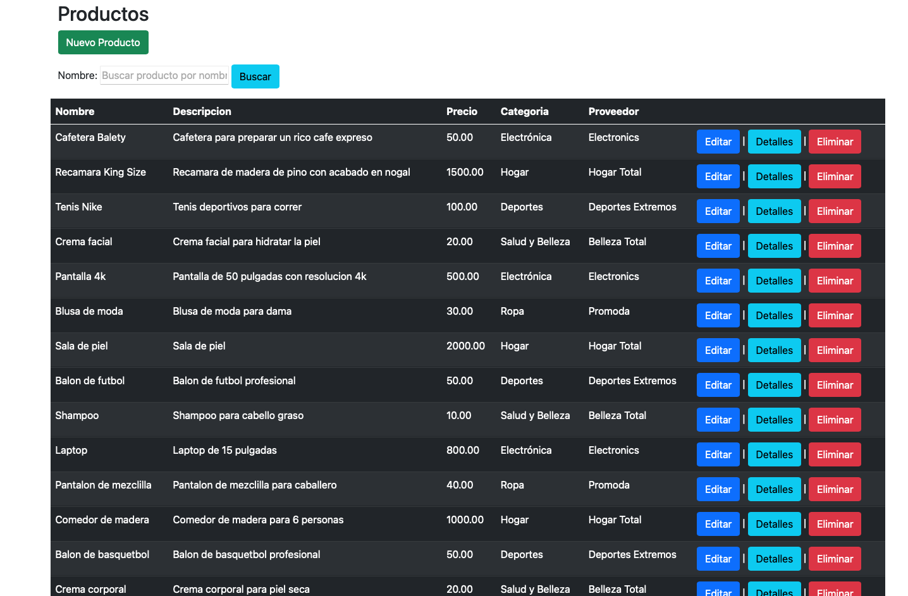

# DemoMVC

Este es un ejemlo de CRUD utilizando C# ASPNETCORE y elpatron MVC, utiliza la pnatilla de dotnet y maneja EFCore para la percistencia de datos.

Utiliza swetalert2 para mostrar mensajes al usuario o pedir confirmacion.

